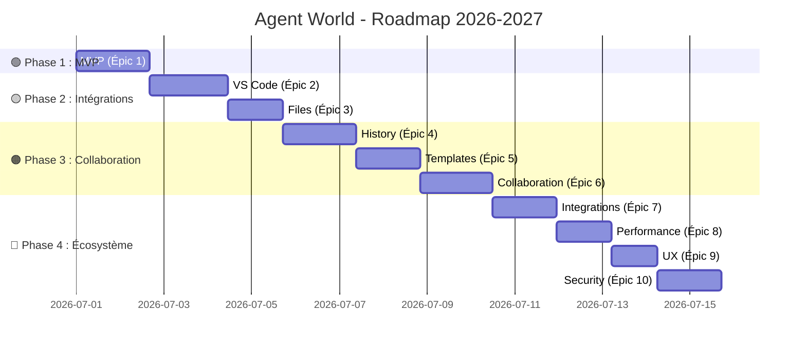

# 🗺️ **Agent World - Roadmap Produit**
*Version : 1.0.0 - Dernière mise à jour : 25 août 2026*

---

## 📌 **Table des Matières**
1. [🎯 Vision du Projet](#-vision-du-projet)
2. [📅 Timeline Globale](#-timeline-globale)
3. [🚀 Feuille de Route par Trimestre](#-feuille-de-route-par-trimestre)
   - [Q3 2026 : Fondations et Intégrations](#q3-2026--fondations-et-intégrations)
   - [Q4 2026 : Collaboration et Templates](#q4-2026--collaboration-et-templates)
   - [Q1 2027 : Performance et Sécurité](#q1-2027--performance-et-sécurité)
   - [Q2 2027 : Écosystème et Entreprise](#q2-2027--écosystème-et-entreprise)
4. [🎯 Objectifs par Version](#-objectifs-par-version)
5. [📊 Métriques Clés](#-métriques-clés)
6. [🔗 Ressources](#-ressources)

---

## 🎯 **Vision du Projet**

**Agent World** vise à devenir **la plateforme open-source de référence** pour la création, la gestion et le déploiement d'agents IA. Notre objectif est de démocratiser l'accès à l'IA en offrant une solution **simple, flexible et collaborative** pour les développeurs, les data scientists et les équipes DevOps.

### **🌟 Valeurs Clés**
- **Open Source** : 100% transparent et contribuable par la communauté.
- **Modularité** : Architecture plug-and-play pour une extensibilité maximale.
- **Collaboration** : Outils intégrés pour le travail d'équipe.
- **Performance** : Optimisé pour des workflows rapides et scalables.
- **Sécurité** : Conforme aux standards les plus stricts (RGPD, SOC 2).

---

## 📅 **Timeline Globale**



| **Période**       | **Épics**                          | **Version** | **Statut**          | **Livrables Principaux**                                                                                     |
|-------------------|------------------------------------|-------------|---------------------|-------------------------------------------------------------------------------------------------------------|
| **Juillet 2026**  | MVP                                | v0.1.0      | ✅ **Terminé**       | Structure de base, API, CLI, documentation.                                                                   |
| **Août 2026**     | VS Code, Files                     | v0.2.0      | ⏳ **En cours**      | Extension VS Code, gestion des fichiers, intégration Git.                                                   |
| **Septembre 2026**| History, Templates                 | v0.3.0      | ⏳ **À venir**       | Historique des agents, bibliothèque de templates, versioning.                                               |
| **Octobre 2026**  | Collaboration                      | v0.4.0      | ⏳ **À venir**       | Invitation d'utilisateurs, gestion des rôles, partage de projets.                                           |
| **Novembre 2026** | Integrations                       | v0.5.0      | ⏳ **À venir**       | GitHub, Slack, Discord, Notion, Google Drive.                                                                   |
| **Décembre 2026** | Performance                        | v0.6.0      | ⏳ **À venir**       | Optimisation API, cache, scalabilité horizontale.                                                             |
| **Janvier 2027**  | UX, Security                        | v0.7.0      | ⏳ **À venir**       | Design system, accessibilité, 2FA, chiffrement.                                                                |
| **Février 2027**  | Multi-Modèles                      | v0.8.0      | ⏳ **À venir**       | Support pour 5+ modèles d'IA, benchmarking.                                                                     |
| **Mars 2027**     | Entreprise                         | v0.9.0      | ⏳ **À venir**       | SSO, audit, conformité SOC 2, support prioritaire.                                                           |
| **Avril 2027**    | Plateforme                         | v1.0.0      | ⏳ **À venir**       | Marketplace de templates, API publique, documentation complète.                                               |

---

## 🚀 **Feuille de Route par Trimestre**

---

### **📅 Q3 2026 : Fondations et Intégrations**
**Thème** : *Stabiliser les bases et intégrer les outils essentiels.*
**Objectif** : Atteindre **100+ utilisateurs actifs** et **50+ stars sur GitHub**.

#### **🎯 Livrables**
| **Mois**        | **Épics**               | **User Stories**                          | **Version** | **Date**       | **Statut**          |
|-----------------|-------------------------|-------------------------------------------|-------------|----------------|---------------------|
| **Juillet**     | MVP                     | US-001 à US-010                           | v0.1.0      | 06 août 2026   | ✅ **Terminé**       |
| **Août**        | VS Code, Files          | US-011 à US-024                           | v0.2.0      | 12 août 2026   | ⏳ **En cours**      |
| **Septembre**   | History, Templates      | US-025 à US-039                           | v0.3.0      | 30 septembre 2026 | ⏳ **À venir**       |

#### **📌 Détails par Mois**

##### **🔹 Juillet 2026 (MVP)**
- **Semaine 1-2** : Initialisation du projet (US-001, US-002).
- **Semaine 3-4** : Développement de l'API et du CLI (US-003 à US-006).
- **Semaine 5-6** : Intégration des modèles IA et tests (US-007 à US-010).
- **Livraison** : **v0.1.0** (06 août 2026).

##### **🔹 Août 2026 (VS Code + Files)**
- **Semaine 1 (Sprint 0)** :
  - US-011 : Ouverture du dashboard VS Code (8h) — ✅ **Terminé**.
  - US-012 : Thème automatique VS Code (4h) — ✅ **Terminé**.
  - US-013 : Ouverture des fichiers dans VS Code (3h) — ✅ **Terminé**.
  - **Total** : 15h → **Livraison partielle v0.2.0-alpha**.
- **Semaine 2 (Sprint 0)** :
  - US-018 : Dossier de sortie personnalisé (2h) — ✅ **Terminé**.
  - US-019 : Noms de fichiers intelligents (4h).
  - US-014 : Exécution de commandes VS Code (5h) — ✅ **Terminé**.
  - US-015 : Notifications VS Code (4h) — ✅ **Terminé**.
  - **Total** : 15h → **Livraison v0.2.0** (12 août 2026).
- **Semaine 3-4** :
  - US-016 : Débogage des agents dans VS Code (8h) — ✅ **Terminé**.
  - US-017 : Intégration Git locale (11h) — ✅ **Terminé**.
  - US-020 à US-024 : Gestion avancée des fichiers.
  - **Livraison** : **v0.2.1** (19 août 2026).

##### **🔹 Septembre 2026 (History + Templates)**
- **Semaine 1-2 (Sprint 1)** :
  - US-025, US-026 : Historique des agents et exécutions.
  - US-033, US-034 : Création et bibliothèque de templates.
  - **Livraison** : **v0.3.0-alpha** (02 septembre 2026).
- **Semaine 3-4 (Sprint 2)** :
  - US-035 à US-039 : Import/export et personnalisation des templates.
  - US-027, US-028 : Restauration et comparaison de versions.
  - **Livraison** : **v0.3.0** (30 septembre 2026).

---

### **📅 Q4 2026 : Collaboration et Templates**
**Thème** : *Permettre le travail d'équipe et enrichir les fonctionnalités de base.*
**Objectif** : Atteindre **500+ utilisateurs actifs** et **200+ stars sur GitHub**.

#### **🎯 Livrables**
| **Mois**        | **Épics**               | **User Stories**                          | **Version** | **Date**       | **Statut**          |
|-----------------|-------------------------|-------------------------------------------|-------------|----------------|---------------------|
| **Octobre**     | Collaboration           | US-040 à US-046                           | v0.4.0      | 30 octobre 2026 | ⏳ **À venir**       |
| **Novembre**    | Integrations            | US-047 à US-053                           | v0.5.0      | 30 novembre 2026| ⏳ **À venir**       |
| **Décembre**    | Performance             | US-054 à US-059                           | v0.6.0      | 20 décembre 2026| ⏳ **À venir**       |

#### **📌 Détails par Mois**

##### **🔹 Octobre 2026 (Collaboration)**
- **Semaine 1-2** :
  - US-040, US-041 : Invitation d'utilisateurs et gestion des rôles.
  - US-042 : Partage de projets.
- **Semaine 3-4** :
  - US-043 à US-046 : Commentaires, historique des modifications, résolution de conflits, chat.
- **Livraison** : **v0.4.0** (30 octobre 2026).

##### **🔹 Novembre 2026 (Integrations)**
- **Semaine 1-2** :
  - US-047, US-048 : Intégrations GitHub et Slack.
  - US-049, US-050 : Intégrations Discord et Notion.
- **Semaine 3-4** :
  - US-051 à US-053 : Intégrations Google Drive, Trello, webhooks personnalisés.
- **Livraison** : **v0.5.0** (30 novembre 2026).

##### **🔹 Décembre 2026 (Performance)**
- **Semaine 1-2** :
  - US-054, US-055 : Optimisation des requêtes API et cache.
  - US-056 : Scalabilité horizontale.
- **Semaine 3-4** :
  - US-057 à US-059 : Optimisation de la base de données, compression, monitoring.
- **Livraison** : **v0.6.0** (20 décembre 2026).

---

### **📅 Q1 2027 : Performance et Sécurité**
**Thème** : *Optimiser les performances et renforcer la sécurité.*
**Objectif** : Atteindre **2000+ utilisateurs actifs** et **1000+ stars sur GitHub**.

#### **🎯 Livrables**
| **Mois**        | **Épics**               | **User Stories**                          | **Version** | **Date**       | **Statut**          |
|-----------------|-------------------------|-------------------------------------------|-------------|----------------|---------------------|
| **Janvier**     | UX, Security            | US-060 à US-070                           | v0.7.0      | 30 janvier 2027 | ⏳ **À venir**       |
| **Février**     | Multi-Modèles           | US-071 à US-075                           | v0.8.0      | 28 février 2027 | ⏳ **À venir**       |
| **Mars**        | Entreprise              | US-076 à US-080                           | v0.9.0      | 31 mars 2027   | ⏳ **À venir**       |

#### **📌 Détails par Mois**

##### **🔹 Janvier 2027 (UX + Security)**
- **Semaine 1-2** :
  - US-060, US-061 : Design system et accessibilité.
  - US-062, US-063 : Internationalisation et thème personnalisable.
- **Semaine 3-4** :
  - US-064 : Animations et transitions.
  - US-065 à US-070 : Authentification forte, permissions, chiffrement, audit, RGPD, protection.
- **Livraison** : **v0.7.0** (30 janvier 2027).

##### **🔹 Février 2027 (Multi-Modèles)**
- **Semaine 1-2** :
  - US-071 : Support pour 5+ modèles d'IA (ex: Mistral, OpenAI, Anthropic, Llama, Gemma).
  - US-072 : Benchmarking des modèles (comparaison des performances).
- **Semaine 3-4** :
  - US-073 : Sélection automatique du meilleur modèle pour une tâche.
  - US-074 : Fallback vers un autre modèle en cas d'échec.
  - US-075 : Gestion des quotas et des coûts par modèle.
- **Livraison** : **v0.8.0** (28 février 2027).

##### **🔹 Mars 2027 (Entreprise)**
- **Semaine 1-2** :
  - US-076 : Authentification SSO (Google, GitHub, Microsoft).
  - US-077 : Audit avancé (logs détaillés, export).
- **Semaine 3-4** :
  - US-078 : Conformité SOC 2.
  - US-079 : Support prioritaire pour les entreprises.
  - US-080 : Facturation et abonnements (pour la version Enterprise).
- **Livraison** : **v0.9.0** (31 mars 2027).

---

### **📅 Q2 2027 : Écosystème et Entreprise**
**Thème** : *Créer un écosystème autour d'Agent World et cibler les entreprises.*
**Objectif** : Atteindre **10 000+ utilisateurs actifs** et **5000+ stars sur GitHub**.

#### **🎯 Livrables**
| **Mois**        | **Épics**               | **User Stories**                          | **Version** | **Date**       | **Statut**          |
|-----------------|-------------------------|-------------------------------------------|-------------|----------------|---------------------|
| **Avril**       | Plateforme              | US-081 à US-085                           | v1.0.0      | 30 avril 2027  | ⏳ **À venir**       |
| **Mai**         | Mobile                  | US-086 à US-090                           | v1.1.0      | 31 mai 2027    | ⏳ **À venir**       |
| **Juin**        | Écosystème              | US-091 à US-095                           | v1.2.0      | 30 juin 2027   | ⏳ **À venir**       |

#### **📌 Détails par Mois**

##### **🔹 Avril 2027 (Plateforme)**
- **Semaine 1-2** :
  - US-081 : Marketplace de templates (achat/vente de templates).
  - US-082 : API publique pour les intégrations tierces.
- **Semaine 3-4** :
  - US-083 : Documentation complète (tutoriels, exemples, FAQ).
  - US-084 : Site web officiel avec démo interactive.
  - US-085 : Programme de partenariats (pour les intégrateurs).
- **Livraison** : **v1.0.0** (30 avril 2027) → **Version stable !**

##### **🔹 Mai 2027 (Mobile)**
- **Semaine 1-2** :
  - US-086 : Application mobile (iOS/Android) pour gérer les agents.
  - US-087 : Synchronisation entre mobile et desktop.
- **Semaine 3-4** :
  - US-088 : Notifications push pour les tâches terminées.
  - US-089 : Mode hors ligne (cache local).
  - US-090 : Intégration avec les assistants vocaux (Siri, Google Assistant).
- **Livraison** : **v1.1.0** (31 mai 2027).

##### **🔹 Juin 2027 (Écosystème)**
- **Semaine 1-2** :
  - US-091 : Plugin WordPress pour intégrer des agents dans un site.
  - US-092 : Intégration avec Zapier/Integromat.
- **Semaine 3-4** :
  - US-093 : Programme de certification pour les développeurs.
  - US-094 : Hackathons et concours pour la communauté.
  - US-095 : Roadmap publique avec vote des utilisateurs.
- **Livraison** : **v1.2.0** (30 juin 2027).

---

## 🎯 **Objectifs par Version**

| **Version** | **Date**       | **Épics**                          | **Fonctionnalités Clés**                                                                                     | **Objectifs**                                                                                     |
|-------------|----------------|------------------------------------|-------------------------------------------------------------------------------------------------------------|-------------------------------------------------------------------------------------------------|
| **v0.1.0** | 06 août 2026   | MVP                                | Structure de base, API, CLI, modèles IA, tests.                                                             | ✅ MVP fonctionnel, ✅ 10+ utilisateurs testeurs.                                               |
| **v0.2.0** | 12 août 2026   | VS Code, Files                     | Extension VS Code, gestion des fichiers, intégration Git.                                                   | ✅ 100+ utilisateurs, ✅ 50+ stars GitHub.                                                       |
| **v0.2.1** | 19 août 2026   | Files                              | Organisation en dossiers, versioning, partage.                                                               | ✅ 150+ utilisateurs.                                                                           |
| **v0.3.0** | 30 septembre 2026| History, Templates                 | Historique des agents, bibliothèque de templates, versioning.                                               | ✅ 500+ utilisateurs, ✅ 200+ stars GitHub.                                                     |
| **v0.4.0** | 30 octobre 2026 | Collaboration                      | Invitation d'utilisateurs, gestion des rôles, partage de projets, chat.                                       | ✅ 1000+ utilisateurs, ✅ 500+ stars GitHub.                                                    |
| **v0.5.0** | 30 novembre 2026| Integrations                       | GitHub, Slack, Discord, Notion, Google Drive, webhooks.                                                        | ✅ 1500+ utilisateurs, ✅ 1000+ stars GitHub.                                                   |
| **v0.6.0** | 20 décembre 2026| Performance                        | Optimisation API, cache, scalabilité horizontale, monitoring.                                                | ✅ 2000+ utilisateurs.                                                                         |
| **v0.7.0** | 30 janvier 2027 | UX, Security                       | Design system, accessibilité, 2FA, chiffrement, RGPD.                                                         | ✅ 3000+ utilisateurs.                                                                         |
| **v0.8.0** | 28 février 2027 | Multi-Modèles                      | Support pour 5+ modèles, benchmarking, fallback.                                                               | ✅ 5000+ utilisateurs.                                                                         |
| **v0.9.0** | 31 mars 2027   | Entreprise                         | SSO, audit, conformité SOC 2, support prioritaire.                                                           | ✅ 7000+ utilisateurs.                                                                         |
| **v1.0.0** | 30 avril 2027  | Plateforme                         | Marketplace, API publique, documentation complète, site web.                                                 | ✅ **Version stable**, ✅ 10 000+ utilisateurs.                                                |
| **v1.1.0** | 31 mai 2027    | Mobile                             | Application mobile, synchronisation, notifications push.                                                   | ✅ 15 000+ utilisateurs.                                                                       |
| **v1.2.0** | 30 juin 2027   | Écosystème                         | Plugin WordPress, Zapier, certification, hackathons.                                                         | ✅ 20 000+ utilisateurs.                                                                       |

---

## 📊 **Métriques Clés**

### **📈 Croissance Utilisateurs**
```
2026-Q3 : 100+ utilisateurs (objectif)
2026-Q4 : 2000+ utilisateurs (objectif)
2027-Q1 : 10 000+ utilisateurs (objectif)
2027-Q2 : 20 000+ utilisateurs (objectif)
```

### **⭐ Popularité sur GitHub**
```
2026-08 : 50+ stars
2026-10 : 500+ stars
2026-12 : 1000+ stars
2027-03 : 5000+ stars
2027-06 : 10 000+ stars
```

### **🤝 Contributions Communautaires**
```
2026-Q3 : 5+ contributeurs
2026-Q4 : 20+ contributeurs
2027-Q1 : 50+ contributeurs
2027-Q2 : 100+ contributeurs
```

### **💻 Intégrations et Plugins**
```
2026-Q4 : 5+ intégrations (GitHub, Slack, Discord, Notion, Google Drive)
2027-Q1 : 10+ intégrations
2027-Q2 : 20+ intégrations (incluant plugins WordPress, Zapier, etc.)
```

---

## 🔗 **Ressources**

### **📚 Documentation**
- [Backlog Complet](BACKLOG.md) : Détail de toutes les user stories et épics.
- [Contributing](CONTRIBUTING.md) : Guide pour contribuer au projet.
- [Installation](INSTALL.md) : Instructions pour installer Agent World.
- [Code de Conduite](CODE_OF_CONDUCT.md) : Règles de la communauté.

### **🛠️ Outils**
- **Repository** : [GoupilJeremy/agent-world](https://github.com/GoupilJeremy/agent-world)
- **Issues** : [GitHub Issues](https://github.com/GoupilJeremy/agent-world/issues)
- **Discussions** : [GitHub Discussions](https://github.com/GoupilJeremy/agent-world/discussions)
- **CI/CD** : GitHub Actions (workflows dans `.github/workflows/`).

### **📢 Communication**
- **Email** : goupiljeremy@gmail.com
- **Discord** : [Lien à ajouter](https://discord.gg/)
- **Twitter** : [@AgentWorld](https://twitter.com/AgentWorld)
- **Blog** : [agent-world.dev/blog](https://agent-world.dev/blog)

---

## 🎨 **Aperçu Visuel**

### **📅 Timeline Visuelle**
```
┌───────────────────────────────────────────────────────────────────────────────┐
│                            AGENT WORLD ROADMAP 2026-2027                         │
├───────────────────────────────────────────────────────────────────────────────┤
│                                                                               │
│  Q3 2026          Q4 2026               Q1 2027               Q2 2027          │
│  ┌─────────────┐  ┌─────────────┐      ┌─────────────┐      ┌─────────────┐ │
│  │  MVP         │  │ Collaboration│      │ Performance  │      │  Écosystème  │ │
│  │  VS Code    │  │ Templates   │      │ UX          │      │  Mobile      │ │
│  │  Files      │  │ Integrations│      │ Security    │      │  Entreprise  │ │
│  └─────────────┘  └─────────────┘      └─────────────┘      └─────────────┘ │
│                                                                               │
│  v0.1.0  v0.2.0  v0.3.0  v0.4.0  v0.5.0  v0.6.0  v0.7.0  v0.8.0  v0.9.0  v1.0.0 │
│    │       │       │       │       │       │       │       │       │       │    │
│    ▼       ▼       ▼       ▼       ▼       ▼       ▼       ▼       ▼       ▼    │
│  Juil.   Août    Sept.   Oct.   Nov.   Déc.   Jan.   Fév.   Mars   Avr.   Mai   Juin│
│                                                                               │
└───────────────────────────────────────────────────────────────────────────────┘
```

### **🎯 Sprint 0 (06-12 août 2026)**
```
┌───────────────────────────────────────────────────────────────────────────────┐
│                        SPRINT 0 : VS CODE + FILES (v0.2.0)                       │
├───────────────────────────────────────────────────────────────────────────────┤
│                                                                               │
│  US-011 : VS Code Dashboard       [8h]  ✅ Done                               │
│  US-012 : Auto Theme              [4h]  ✅ Done                               │
│  US-013 : Open in VS Code         [3h]  ✅ Done                               │
│  US-018 : Custom Output Dir       [2h]  ✅ Done                               │
│  US-019 : Smart Filenames         [4h]  ⏳ To Do                              │
│                                                                               │
│  Total : 21h → Livraison : 12 août 2026 (v0.2.0)                              │
│                                                                               │
└───────────────────────────────────────────────────────────────────────────────┘
```

---

## 📝 **Notes**
- Les dates sont **estimatives** et peuvent être ajustées en fonction des retours de la communauté.
- Les versions **v0.x.x** sont des versions **bêta** (pour les early adopters).
- La version **v1.0.0** marquera la **stabilité** de la plateforme.
- Les fonctionnalités **P2 (Could Have)** peuvent être reportées si nécessaire.
- **Dette MVP vérifiée le 25 août 2026** : la suite backend compte 105 tests
  (104 réussis et un scénario de lien symbolique ignoré sous Windows), mais la
  couverture globale reste à 68 % et les appels aux fournisseurs IA sont encore
  simulés. Le seuil de 90 % et les connecteurs réels restent à traiter.

---

*Document généré le 06 août 2026. Dernière mise à jour : 25 août 2026.*
